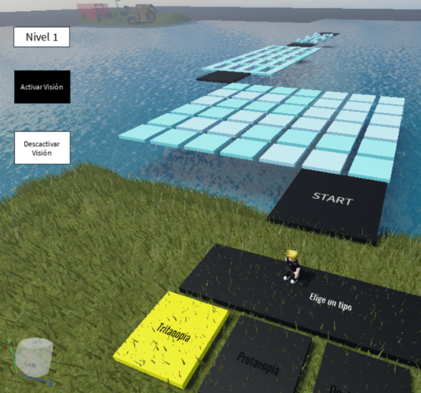

# Anti-Color Race

La diferencia genética que sugiere el daltonismo puede considerarse como una ventaja. Es cuestión de identificar ciertas posibles ventajas compensatorias, como puede ser que quienes cuentan con esta diferenciacion puedan distinguir mejor el camuflaje o ver ciertos patrones que posiblemente se hacen más dificiles de ver cuando no se tienen estas alteraciones en los fotorreceptores.

El juego en Roblox se llama Anti-Color race y fue creado en Q1-Q2 de 2022

## ¿Cómo funciona?

Inicialmente, se usa una paleta de colores y un simulador ([Color blindess simulator](https://daltonlens.org/colorblindness-simulator)), los cuales permiten evidenciar la vista desde esta perspectiva

- Visión sin Colorblind

- Visión con Protanopia

- Visión con Tritanopia

- Visión con Deuteranopia

Luego, se identifican diferentes sitios en la ruleta de los los cuales las personas "normales" verían colores aleatorios y personas que tienen este distintivo los verían del mismo color:

asdsadasda

Ya identificada una cierta cantidad de colores, se procede a crear un laberinto (en este ejemplo con protanopia) que genera de manera aleatoria un patrón que lo seguirán de manera más facil quienes tienen este diferenciador.

- Sin protanopia

- Con protanopia

Como se puede observar, quienes tienen protanopia son capaces de identificar ciertos patrones que no se distinguen (o no de manera clara) con una visión "normal".

Entonces, se procede a crear un serious game con esta información usando los siguientes tipos de daltonismo (según el [NIH](https://www.nei.nih.gov/espanol/aprenda-sobre-la-salud-ocular/enfermedades-y-afecciones-de-los-ojos/daltonismo/tipos-de-daltonismo)):

- **Tritanopia**: hace que no pueda distinguir entre el azul y el verde, entre el morado (violeta) y el rojo, y entre el amarillo y el rosado
- **Deuteranopia** y **Protanopia**: ambos tipos hacen que usted no pueda distinguir la diferencia entre el rojo y el verde.
- **Tritanomalía**: hace que sea difícil diferenciar entre el azul y el verde, y entre el amarillo y el rojo.
- **Protanomalía**: hace que ciertas tonalidades de rojo se vean más verdes y menos brillantes
- **Deuteranomalía**: hace que ciertas tonalidades de verde se vean más rojas. Este tipo es leve y no suele interferir con las actividades normales.
- **Acromatopsia**: es el daltonismo completo, hace que se vea todo a blanco y negro. Además se tendrían problemas para ver con claridad.

Por lo que se crea una carrera de obstáculos con diferentes formas de completar usando 4 tipos de daltonismo: tritanopia, protanopia, deuteranopia y acromatopsia.

También se añaden 2 botones para activar la visión del modo de juego seleccionado, para que el nivel pueda ser completado correctamente.

Todo esto se codifica para que al momento de elegir un color, automáticamente se muestre la pista de obstáculos que se puede resolver identificando un patrón que se puede ver activando la visión (el tipo de daltonismo).

En este caso se muestra el ejemplo del nivel con Tritanopia seleccionado, sin y con visión:

Como se puede observar, al activar la visión de tritanopia, se puede identificar el patrón de manera sencilla. Las personas que cuantan con esta diferenciación pueden resolver de manera más activa esta clase de ejercicios.
